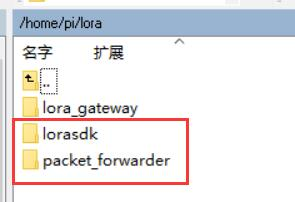

# lorasdk
Scripts and files for LoRa gateway produced by Heltec automation(TM). This file should work with raspberry pi.

## install
- clone this project into raspberry pi, and lorasdk and packet_forwarder should in a same folder. e.g. 


  ```bash
  cd /home/pi/lora/lorasdk
  chmod +x install.sh
  ./install.sh
  ```
